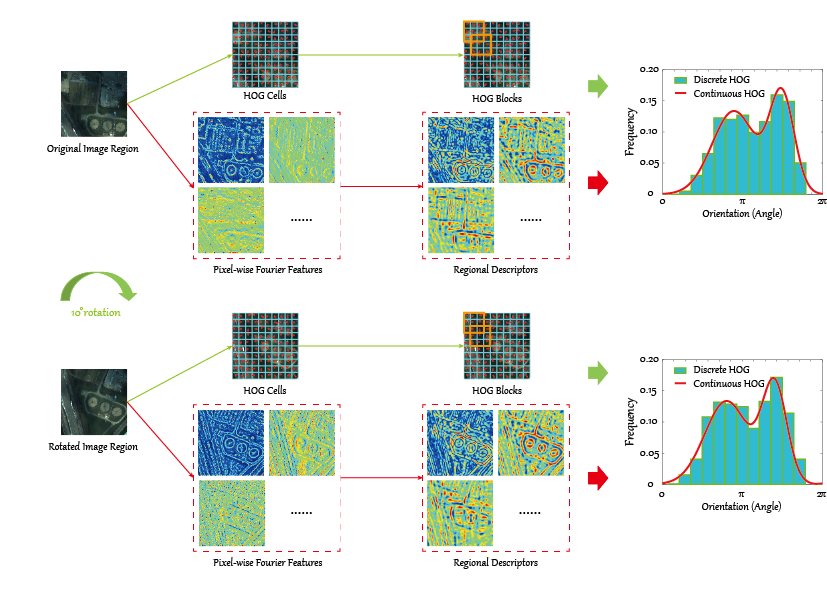

# Invariant Attribute Profiles: A Spatial-Frequency Joint Feature Extractor for Hyperspectral Image Classification  

Danfeng Hong, Xin Wu, Pedram Ghamisi, Jocelyn Chanussot, Naoto Yokoya, Xiaoxiang Zhu
---------------------

The code in this toolbox implements the ["Invariant Attribute Profiles: A Spatial-Frequency Joint Feature Extractor for Hyperspectral Image Classification"](https://ieeexplore.ieee.org/document/8961105).
More specifically, it is detailed as follow.

Citation
---------------------

**Please kindly cite the papers if this code is useful and helpful for your research.**

     @article{hong2020invariant,
      title={Invariant Attribute Profiles: A Spatial-Frequency Joint Feature Extractor for Hyperspectral Image Classification},
      author={D. Hong and X. Wu and P. Ghamisi and J. Chanussot and N. Yokoya and X. Zhu},
      journal={IEEE Trans. Geosci. Remote Sens.},
      year={2020},
      note={DOI:10.1109/TGRS.2019.2957251},
      publisher={IEEE}
     }

System-specific notes
---------------------
The code was tested in Matlab R2016a or higher versions on Windows 10 machines.

How to use it?
---------------------

Directly run demo.m to reproduce the results on the Houston2013 data, which exists in the aforementioned paper.  

Note that the hyperspectral and simulated multispectral Houston2013 data can be downloaded from  
[google drive](https://drive.google.com/open?id=1Inpi2_lHuvEWdJX_Duj9ild1_a0LHKmD)  
[baiduyun](https://pan.baidu.com/s/10nyhL59pmkfxlYpATe0Vxw): 07tt (access code).

If you want to run the code in your own data, you can accordingly change the input (e.g., data) and tune the parameters.

If you encounter the bugs while using this code, please do not hesitate to contact us.

Licensing
---------

Copyright (C) 2019 Danfeng Hong

This program is free software: you can redistribute it and/or modify it under the terms of the GNU General Public License as published by the Free Software Foundation, version 3 of the License.

This program is distributed in the hope that it will be useful, but WITHOUT ANY WARRANTY; without even the implied warranty of MERCHANTABILITY or FITNESS FOR A PARTICULAR PURPOSE. See the GNU General Public License for more details.

You should have received a copy of the GNU General Public License along with this program.

Contact Information:
--------------------

Danfeng Hong: hongdanfeng1989@gmail.com 
Danfeng Hong is with the Remote Sensing Technology Institute (IMF), German Aerospace Center (DLR), Germany;  
&nbsp; &nbsp; &nbsp; &nbsp; &nbsp; &nbsp; &nbsp; &nbsp; &nbsp; &nbsp; &nbsp; &nbsp; &nbsp; &nbsp; with the Singnal Processing in Earth Oberservation (SiPEO), Technical University of Munich (TUM), Germany. 
